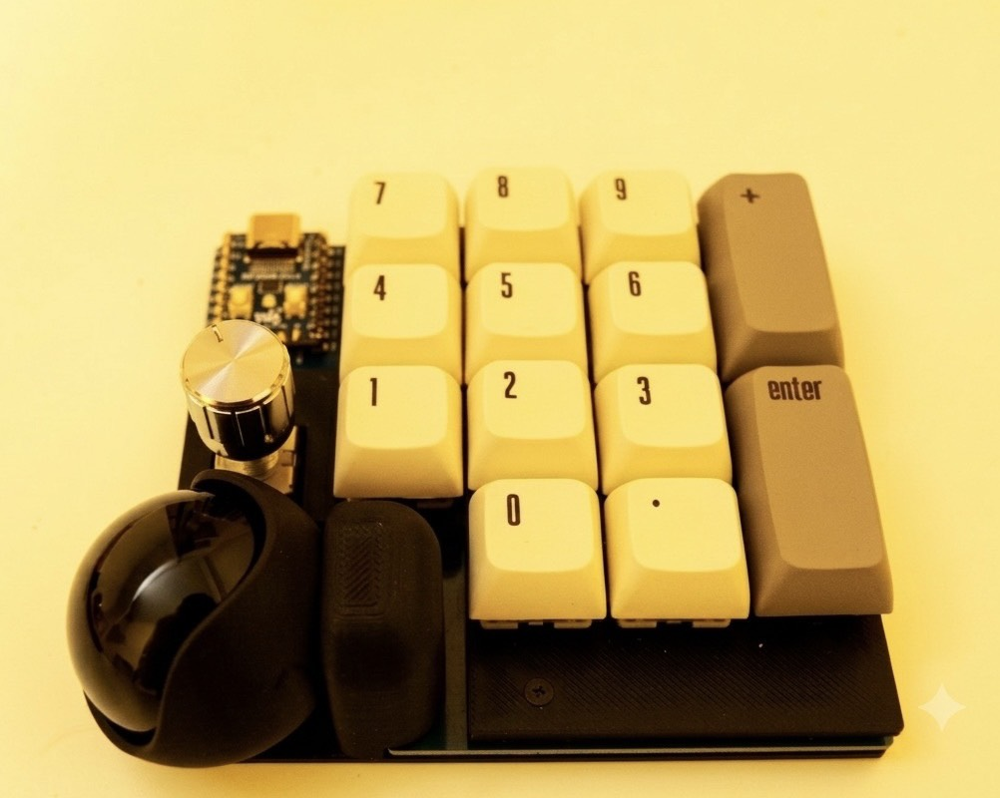

# Tenkoro14

**トラックボール搭載 右手用テンキーデバイス**

---

## 概要

Tenkoro14は、トラックボールマウスとテンキーの機能を1台に凝縮した右手用デバイスです。

マウスとテンキーの間で手を移動させることなく、トラックボールでセルを選択してそのまま数値入力できます。Excelなどの表計算ソフトでの作業効率が大幅に向上します。

### 特徴

- **14キー**：Numpad 0〜9、`.`、`Enter`、`+`、カスタマイズ可能な1キー
- **トラックボール**：Keyball方式（PMW3610センサー）
- **オートマウスレイヤー**：トラックボール操作時に自動でマウスレイヤーに切り替え
- **ロータリーエンコーダ対応**：1キーをロータリーエンコーダに換装可能
- **Keyballトラックボールケース互換**：Keyball用ケースがそのまま使用可能
- **ダイオードレス設計**：はんだづけ箇所を最小限に
- **ホットスワップ＆直付け対応**：初心者から上級者まで対応

---

## 使用例

- **Excel / スプレッドシート**：トラックボールでセルを選択 → そのまま数値入力
- **DAW / 動画編集**：ロータリーエンコーダで音量・タイムライン操作
- **特定アプリ専用デバイス**：Vialでレイヤーをカスタマイズ

---

## スペック

| 項目 | 内容 |
|------|------|
| キー数 | 14キー |
| マイコン | RP2040 Zero |
| トラックボールセンサー | PMW3610 |
| トラックボールケース | Keyball互換 |
| キースイッチ | MX互換（ホットスワップ / 直付け両対応） |
| ファームウェア | QMK / Vial |
| 接続 | USB-C |

---

## 必要部品（BOM）

### 共通部品（すべての構成で必要）

| 部品 | 数量 | 備考 |
|------|------|------|
| PCB | 1 | |
| L字コンスルー 7pin（マックエイト） | 1 | PMW3610接続用・キット同梱 |
| PMW3610 ブレイクアウトボード | 1 | roBa互換品・キット同梱 |
| トラックボールケース | 1 | Keyball用互換品・キット同梱 |
| ピンヘッダ（9pin×2、5pin×1） | 1セット | RP2040 Zero取り付け用・キット同梱 |
| RP2040 Zero | 1 | |
| キースイッチ（MX互換） | 14 | |
| キーキャップ（1U） | 11〜12 | テンキー用を推奨（※下記注意事項参照） |
| キーキャップ（2U） | 2 | |
| ホットスワップソケット | 14 | 直付けの場合は不要 |
| M1.7ネジ | 2 | トラックボールケース固定用・キット同梱 |
| トラックボール（ボール） | 1 | 推奨：25mm／34mmも使用可能（※下記注意事項参照） |
| ロータリーエンコーダ EC11 | 0〜1 | オプション |
| M2スペーサー（7mm） | 4 | ミドルアクリル（3mm）込みの高さ |
| M2ネジ（4〜5mm） | 8 | |
| USBケーブル（Type-C） | 1 | |

### プレート（いずれかを選択）

| 構成 | トッププレート | ミドルアクリル | ボトムプレート | 入手方法 |
|------|--------------|--------------|--------------|---------|
| **キット** | FR4（同梱） | 透明アクリル（同梱） | 透明アクリル（同梱） | キット購入 |
| **PCBのみ／自作** | STLデータで3Dプリント可 | STLデータで3Dプリント可 | STLデータで3Dプリント可 | 本リポジトリのデータを使用 |
| **PCBのみ／発注** | FR4データで発注（JLCPCB等） | アクリルデータで発注（Elecrow等） | アクリルデータで発注（Elecrow等） | 本リポジトリのデータを使用 |

> ミドルアクリルはロータリーエンコーダ搭載位置に切り欠きあり。

### キーキャップについて

テンキー用キーキャップセットの使用を推奨します。

> ⚠️ 一般的なテンキー用キーキャップセットでは、`0`キーが**2U**（横2倍サイズ）で付属している場合があります。Tenkoro14では`0`キーに**1U**のキーキャップが必要です。購入の際はセット内容をご確認ください。

### トラックボール（ボール）のサイズについて

用途に合わせてボールサイズを選んでください。

- **34mm**：操作性が高く、トラックボールマウスとしての使い勝手を重視する方に。`0`キーが若干打ちにくく感じる場合があります。
- **25mm**：テンキー入力をメインに使う方に。全キーを快適に操作できます。

---

## ファームウェア

### ダウンロード

ファームウェア `tenkoro14_vial.uf2` は [`firmware/`](firmware/) または
[**Releases**](../../releases/latest) から入手できます。

> 🛠 自作用の設計データ（プレート切削用DXF・各STL・3Dプリントケース）は
> [`hardware/`](hardware/) にまとめてあります。

### 書き込み方法

1. BOOTボタンを押しながらUSB接続（または BOOTボタンを押しながらリセット）
2. `RPI-RP2` ドライブとして認識される
3. `tenkoro14_vial.uf2` をドライブにコピー
4. 自動的に再起動してキーボードとして認識される

### Vialでキーマップを変更

[Vial](https://get.vial.today/) を使用してキーマップをカスタマイズできます。

---

## ビルドガイド

→ [buildguide.md](docs/buildguide.md) を参照してください。

---

## 部品の購入先

以下のショップで必要な部品を購入できます。

| 部品 | 購入先 |
|------|--------|
| RP2040 Zero | [Talpkeyboard](https://talpkeyboard.net/) / [遊舎工房](https://shop.yushakobo.jp/) |
| キースイッチ（MX互換） | [Talpkeyboard](https://talpkeyboard.net/) / [遊舎工房](https://shop.yushakobo.jp/) |
| ホットスワップソケット | [Talpkeyboard](https://talpkeyboard.net/) / [遊舎工房](https://shop.yushakobo.jp/) |
| トラックボール（ボール） | [遊舎工房](https://shop.yushakobo.jp/) / Amazon |
| キーキャップ | [Talpkeyboard](https://talpkeyboard.net/) / [遊舎工房](https://shop.yushakobo.jp/) |

---

## キーアサインのおすすめ

テンキー入力時に数字の打ち間違いが多い場面では、`+`キーに **`BS`または`Del`** を割り当てることをおすすめします。Vialで自由にカスタマイズできます。

## レイヤー構成（デフォルト）

| レイヤー | 内容 |
|---------|------|
| Layer 0 | テンキー（Numpad） |
| Layer 1 | オートマウス（トラックボール操作時に自動切替） |
| Layer 2 | カスタム |

---

## ライセンス

- ファームウェア：[GPL-2.0](LICENSE)
- ハードウェア設計：© Unikedama

---

## クレジット・スペシャルサンクス
- トラックボール付きキーボード keyballの製作者：ヨーキース様をはじめとする、自作キーボード界隈の先輩方
- トラックボールケース：[kepeo](https://www.thingiverse.com/kepeo) 氏の設計（[CC BY 4.0](https://creativecommons.org/licenses/by/4.0/)）を一部改変して使用
- ファームウェア：[QMK Firmware](https://qmk.fm/) / [Vial](https://get.vial.today/)
