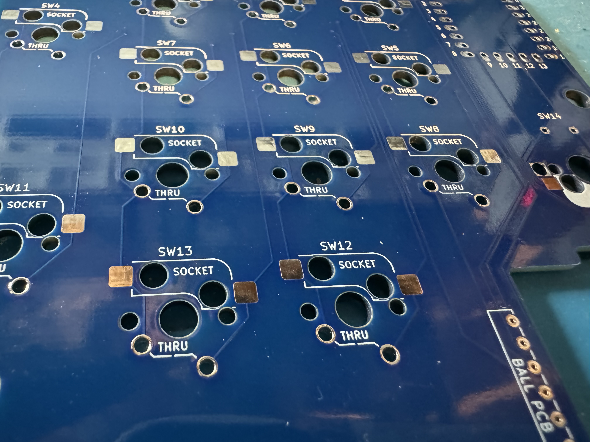
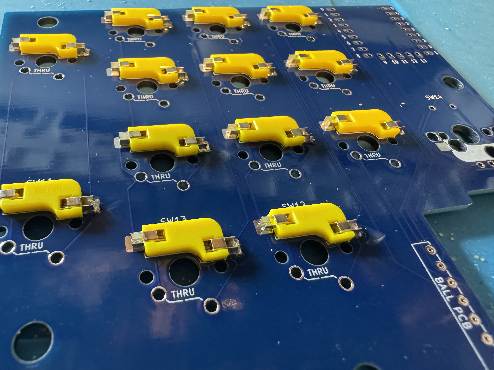
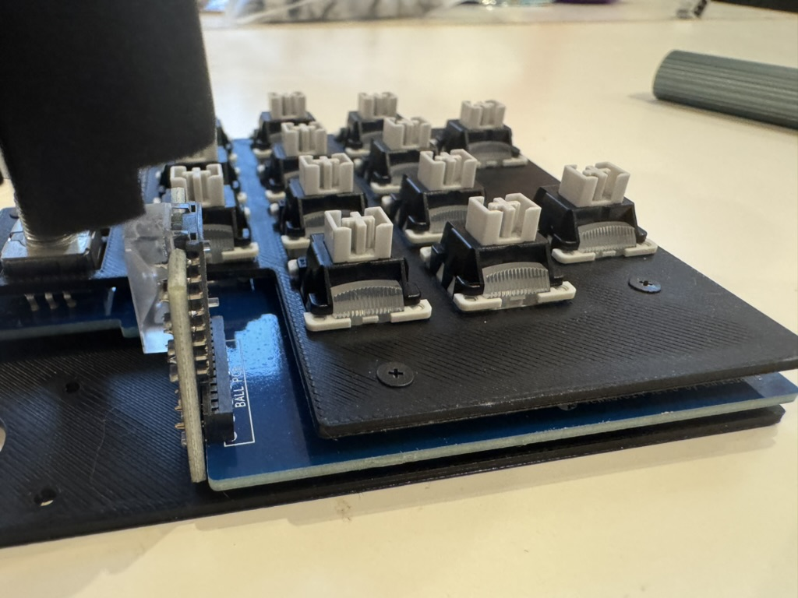
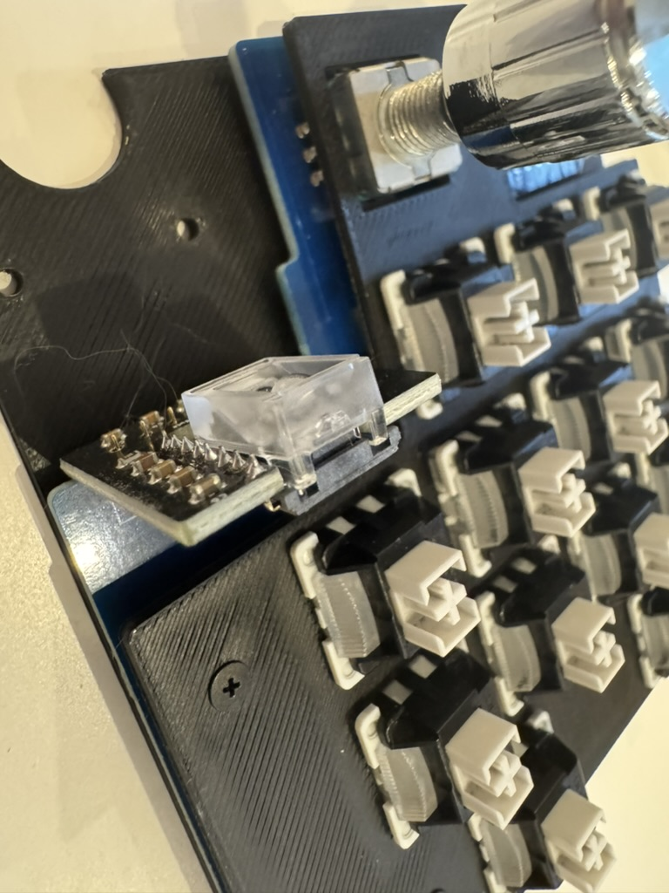
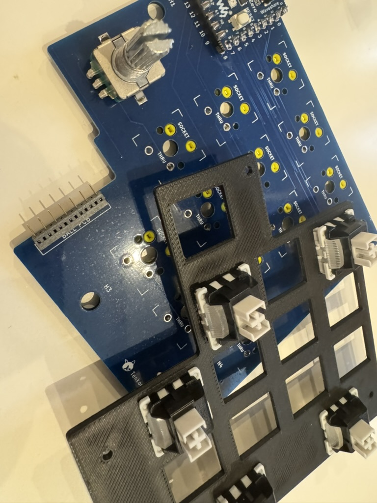
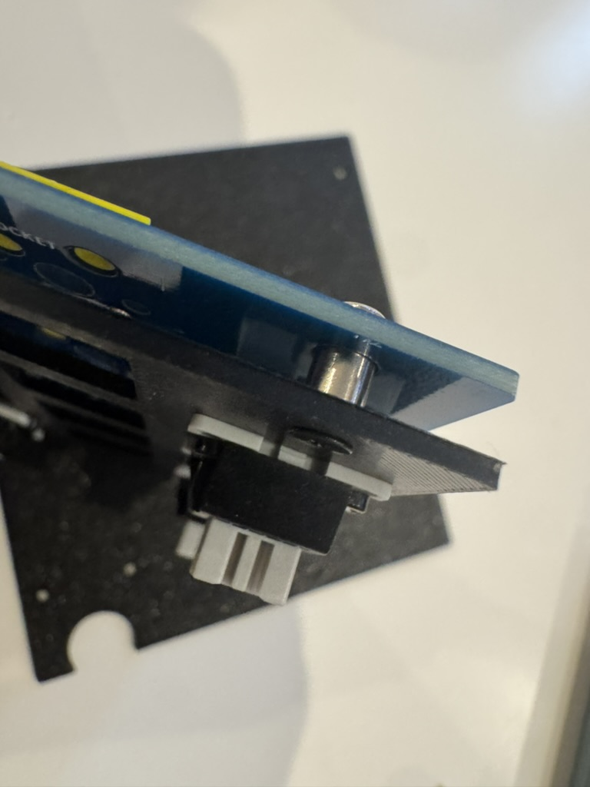
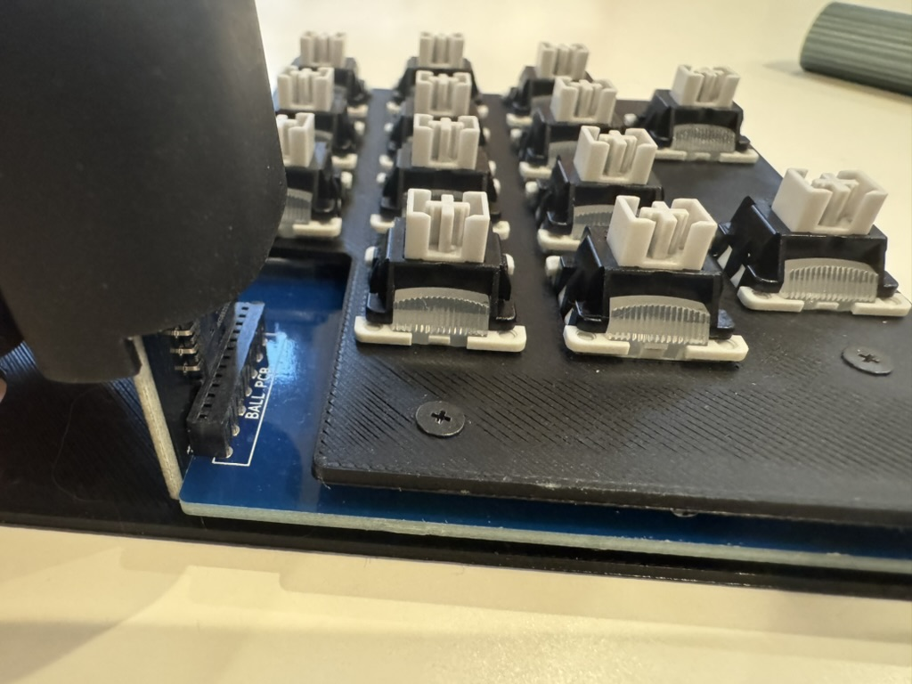
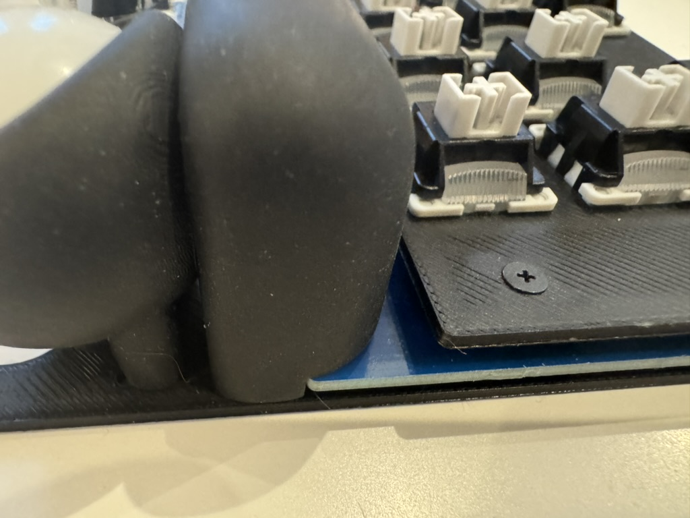
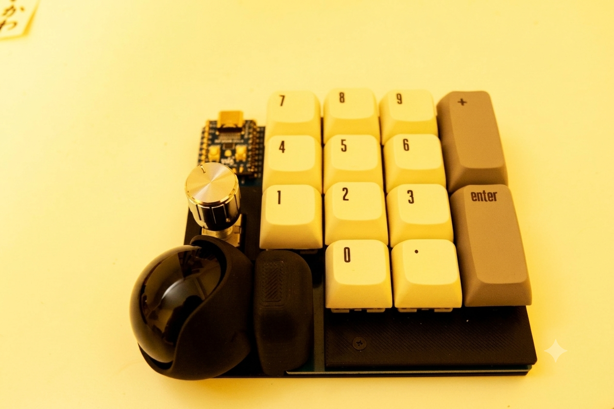

# Tenkoro14 ビルドガイド

## 目次

1. [内容物確認](#1-内容物確認)
2. [必要な工具](#2-必要な工具)
3. [ホットスワップソケットのはんだ付け（オプション）](#3-ホットスワップソケットのはんだ付けオプション)
4. [RP2040 Zeroの取り付け](#4-rp2040-zeroの取り付け)
5. [PMW3610ブレイクアウトボードの取り付け](#5-pmw3610ブレイクアウトボードの取り付け)
6. [キースイッチの取り付け](#6-キースイッチの取り付け)
7. [ファームウェアの書き込み](#7-ファームウェアの書き込み)
8. [動作確認](#8-動作確認)
9. [プレートの組み立て](#9-プレートの組み立て)
10. [トラックボールケースの取り付け](#10-トラックボールケースの取り付け)
11. [完成・キーマップのカスタマイズ](#11-完成キーマップのカスタマイズ)

---

## 1. 内容物確認

キット版には以下が含まれています。

| 部品 | 数量 |
|------|------|
| PCB | 1 |
| L字コンスルー 7pin（マックエイト） | 1 | PMW3610接続用 |
| PMW3610 ブレイクアウトボード | 1 |
| トラックボールケース | 1 |
| ピンヘッダ | 1セット | RP2040 Zero取り付け用 |
| トッププレート（FR4） | 1 |
| ミドルアクリル（3mm） | 1 |
| ボトムアクリル（透明） | 1 |
| M2スペーサー（7mm） | 4 |
| M2ネジ（4〜5mm） | 8 |
| M1.7ネジ | 2 |

以下は別途ご用意ください。

| 部品 | 数量 | 備考 |
|------|------|------|
| RP2040 Zero | 1 | |
| キースイッチ（MX互換） | 14 | |
| ホットスワップソケット | 14 | 直付けの場合は不要 |
| キーキャップ（1U） | 11〜12 | テンキー用推奨。`0`キーは1U必要（※注意参照） |
| キーキャップ（2U） | 2 | |
| トラックボール（ボール） | 1 | 25mm推奨、34mm使用可 |
| ロータリーエンコーダ EC11 | 0〜1 | オプション |
| USBケーブル（Type-C） | 1 | |

---

## 2. 必要な工具

| 工具 | 備考 |
|------|------|
| はんだごて | 温度調整できるものを推奨 |
| はんだ | 0.8mm程度 |
| フラックス | あると便利 |
| ニッパー / ペンチ | ピンヘッダのカットに使用 |
| ピンセット | ソケット取り付けに便利 |
| テスター | 動作確認に便利（必須ではない） |

---

## 3. ホットスワップソケットのはんだ付け（オプション）

キースイッチをホットスワップ対応にする場合に行います。直接はんだ付けする場合はスキップしてください。

1. PCB裏面のソケット取り付けパッドにフラックスを塗る
2. ソケットをパッドに合わせて置く
3. ソケットの片側のパッドにはんだを盛り、固定する
4. もう片側もはんだ付けする
5. 14個すべて取り付ける

> ⚠️ ソケットの向きに注意してください。左右が逆になるとスイッチが入りません。

---

## 4. RP2040 Zeroの取り付け

ピンヘッダを使用してRP2040 Zeroを取り付けます。

1. キット付属のピンヘッダをPCBのRP2040 Zero用ランドに差し込む（長い方を上にする）
2. RP2040 Zeroをピンヘッダに差し込む
3. RP2040 Zeroが水平になっていることを確認する
4. PCB側をはんだ付けする
5. RP2040 Zero側をはんだ付けする

> 💡 ピンが長すぎる場合は、RP2040 Zeroを差し込んだ状態でペンチなどでカットしてから、はんだ付けを行うと整えやすいです。

---

## 5. PMW3610ブレイクアウトボードの取り付け

L字コンスルー（7pin）を使用して取り付けます。Keyball / roBaと同じ方式で抜き差し可能です。

1. L字コンスルーのU字型になっていない方をPCB表面のPMW3610用ランドに差し込む
2. マスキングテープで浮かないよう固定する
3. PCB裏面からはんだ付けする
4. PMW3610ブレイクアウトボードをL字コンスルーに垂直に差し込む

> ⚠️ カプトンテープ（保護フィルム）がセンサー面に貼ってある場合は、取り付け前に剥がしてください。剥がし忘れるとトラックボールが動作しません。

---

## 6. キースイッチの取り付け

### ホットスワップソケットを使用する場合

1. トッププレートにキースイッチをはめ込む
2. スイッチの足がソケットの穴に合っていることを確認して押し込む

### 直接はんだ付けする場合

1. トッププレートにキースイッチをはめ込む
2. PCB裏面からスイッチの足をはんだ付けする

> ロータリーエンコーダを使用する場合は、該当箇所にEC11を取り付けてはんだ付けしてください。

---

## 7. ファームウェアの書き込み

1. RP2040 ZeroのBOOTボタンを押しながらUSBケーブルを接続する
2. `RPI-RP2` というドライブとして認識される
3. [Releases](../../releases) からダウンロードした `tenkoro14_vial.uf2` をドライブにコピーする
4. 自動的に再起動してキーボードとして認識される

---

## 8. 動作確認

プレートを組み立てる前に動作確認を行います。

1. USBケーブルで接続する
2. [Vial](https://get.vial.today/) を起動してキーボードが認識されているか確認する
3. ピンセットなどでスイッチのランド（またはソケット）を短絡させてキー入力を確認する
4. トラックボールを動かしてカーソルが動くか確認する

> macOSの場合、Vialの認識には「システム設定」→「プライバシーとセキュリティ」→「入力監視」でVialを許可する必要があります。

---

## 9. プレートの組み立て

1. ボトムアクリルの保護シートを剥がす
2. ボトムアクリルの4隅にM2スペーサーをM2ネジで固定する
3. ミドルアクリルの保護シートを剥がし、スペーサーの上に置く
4. PCBをミドルアクリルの上に置く
5. トッププレートをPCBの上に置く
6. 上からM2ネジで固定する

---

## 10. トラックボールケースの取り付け

1. PMW3610のレンズをブレイクアウトボードに取り付ける（未取り付けの場合）
2. トラックボールケースをPCB上の所定位置に合わせる
3. M1.7ネジ2本で固定する
4. トラックボール（ボール）をケースにはめ込む

---

## 11. 完成・キーマップのカスタマイズ

お疲れ様でした！完成です。

Vialを使ってキーマップを自由にカスタマイズできます。

### おすすめ設定

- `+`キーに `BS` または `Del` を割り当てると、テンキー入力時の打ち間違いを素早く修正できます。
- トラックボール操作時はオートマウスレイヤーが自動的に有効になります。

### トラブルシューティング

| 症状 | 対処法 |
|------|--------|
| キーボードが認識されない | BOOTボタンを押しながら再接続してuf2を再書き込み |
| Vialに表示されない | macOSの入力監視の権限を確認 |
| トラックボールが動かない | カプトンテープが剥がれているか確認。レンズが取り付けられているか確認 |
| 特定のキーが反応しない | ホットスワップソケットのはんだを確認。スイッチの足が曲がっていないか確認 |
